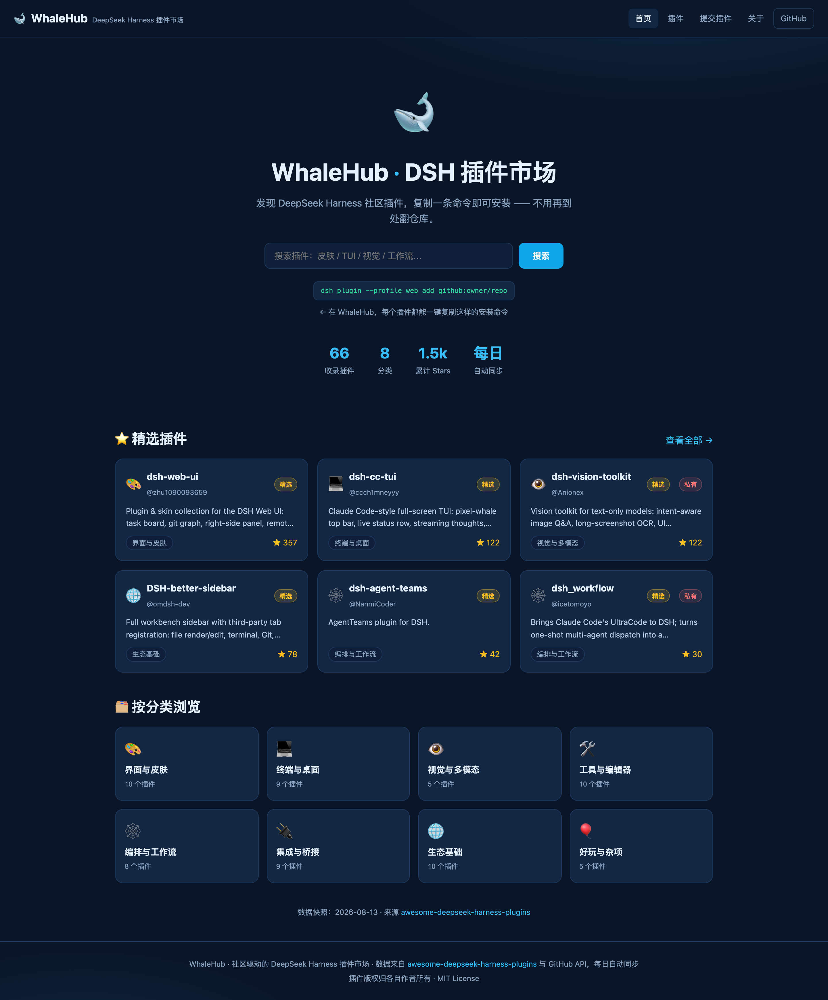
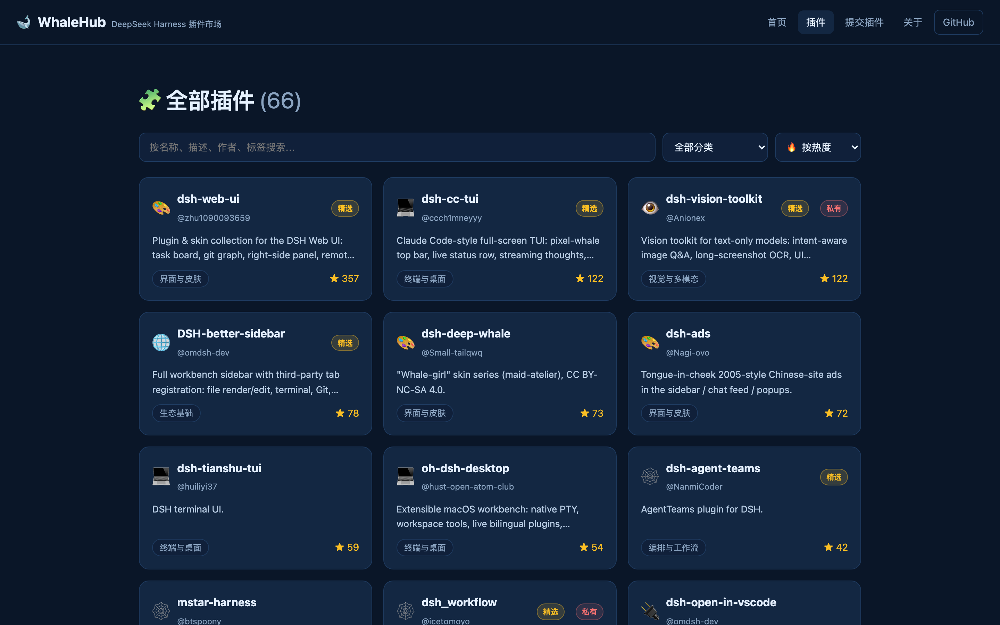
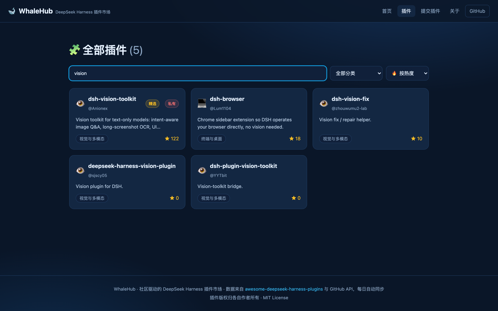
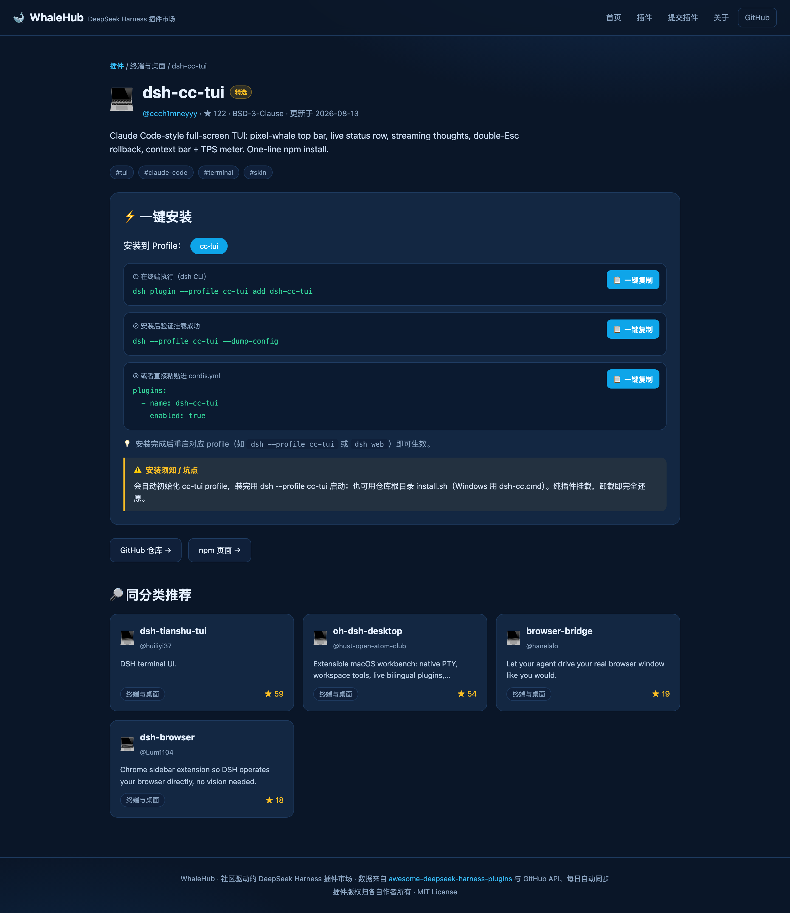
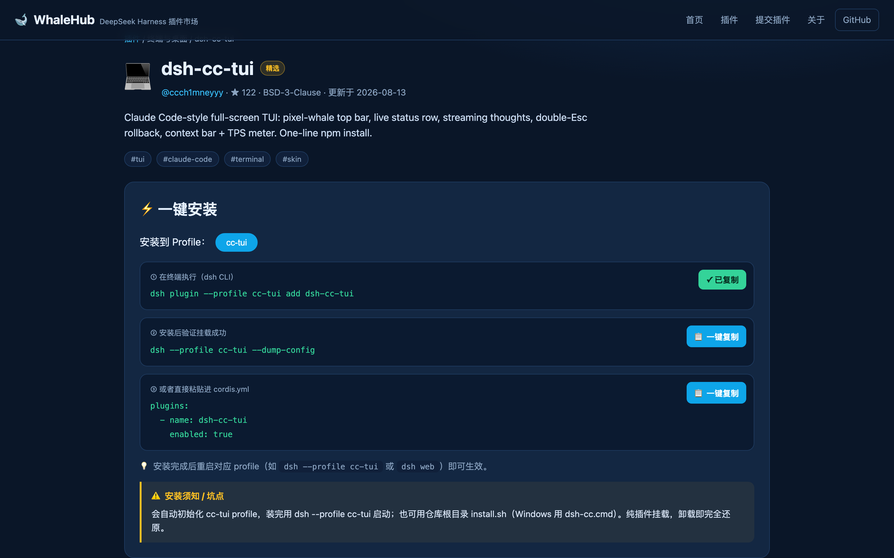
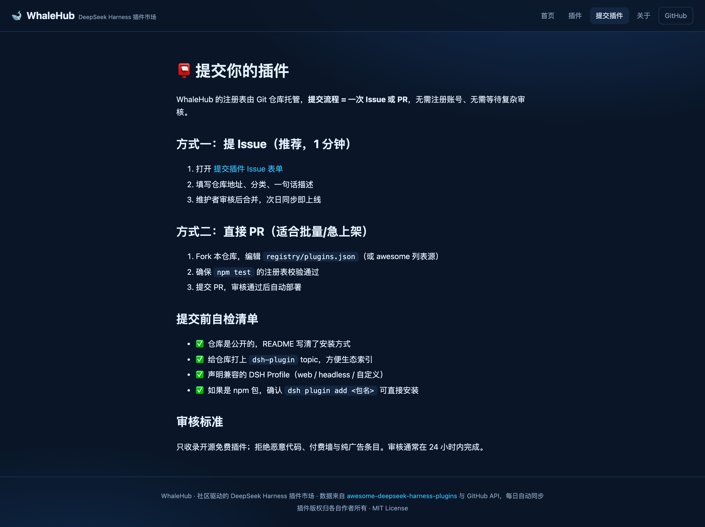
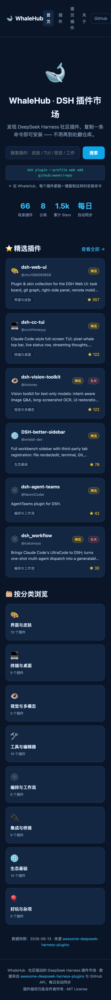

<div align="center">

# 🐋 WhaleHub

**DeepSeek Harness 的社区插件市场 —— 发现、搜索、一键安装，不用再到处翻仓库。**

[](https://github.com/vvlife/whalehub-dsh/actions/workflows/ci.yml)
[](https://github.com/vvlife/whalehub-dsh/actions/workflows/sync.yml)
[](https://github.com/vvlife/whalehub-dsh/blob/main/registry/plugins.json)
[](LICENSE)

**[🌐 在线访问 WhaleHub](https://whalehub-dsh.vercel.app)**（国内备用镜像：[GitHub Pages](https://vvlife.github.io/whalehub-dsh/)） · [提交插件](https://github.com/vvlife/whalehub-dsh/issues/new?template=submit-plugin.yml) · [PRD](docs/PRD.md)

</div>

---

## 为什么做 WhaleHub？

[DeepSeek Harness (DSH)](https://github.com/deepseek-ai/deepseek-harness) 的信条是 **"Everything is a Plugin"**。发布一天之内社区就涌出了几十上百个插件——皮肤、TUI、视觉工具、工作流……但它们散落在各个 GitHub 仓库里：**找到一个插件要搜半天，装对一个插件要翻半天 README**。

WhaleHub 把整个生态聚到一个页面里：打开网站 → 搜索/浏览 → 复制一条 `dsh plugin add` 命令 → 粘贴进终端 → 重启，完成。

## ✨ 功能一览

### 首页：精选 + 分类导航 + 全局搜索



### 插件列表：搜索 / 分类筛选 / 排序

支持按名称、描述、作者、标签模糊搜索，按热度（Stars）、最近更新、名称排序。





### 插件详情：一键安装面板

每个插件都有安装面板：**选 Profile → 一键复制安装命令**，同时提供 `--dump-config` 校验命令和 `cordis.yml` 配置片段；有坑点的插件附实测安装须知。





### 提交插件：Issue 表单 / PR 两种姿势



### 移动端自适应



## 📦 更进一步：把 WhaleHub 装进 DSH Web

装上 `whalehub-market` 插件后，连"复制命令"都省了——DSH Web 的 **Settings → Plugins** 会多出「🐋 插件市场」Tab，浏览、搜索、**点一下就装好**（host 半直接执行 `dsh plugin add`，装完重启生效）：

```sh
dsh plugin --profile web add "github:vvlife/whalehub-dsh#main&path:/plugin"
# 重启 dsh web → Settings → Plugins → 🐋 插件市场
```


实现参考了官方 `ui-settings-plugin-inventory`（`settings.plugins.tab` slot 贡献）与 `dsh-better-sidebar`（双半包构建、`ctx.webServer` 路由、Host 头信任围栏）。详见 [plugin/README.md](plugin/README.md)。

## 🚀 快速开始（用户）

1. 装好 DSH（`dsh web` 能打开 http://127.0.0.1:3080）
2. 打开 **[WhaleHub](https://whalehub-dsh.vercel.app)**（国内可用 [GitHub Pages 镜像](https://vvlife.github.io/whalehub-dsh/)），找到想要的插件
3. 点进详情页，选你的 Profile（一般是 `web`），点 **一键复制**
4. 粘贴进终端执行，例如：

```sh
dsh plugin --profile web add dsh-better-sidebar@0.10.2
dsh --profile web --dump-config   # 验证挂载成功
# 重启 dsh web 生效
```

## 📮 提交插件（开发者）

- **提 Issue**：用 [提交插件表单](https://github.com/vvlife/whalehub-dsh/issues/new?template=submit-plugin.yml)，1 分钟搞定
- **提 PR**：直接改 [`registry/plugins.json`](registry/plugins.json)，CI 会自动校验 schema
- 也推荐给上游 [awesome-deepseek-harness-plugins](https://github.com/vvlife/awesome-deepseek-harness-plugins) 提 PR，WhaleHub 每日自动同步

## 🏗️ 架构：零后端，Git 即数据库

```
awesome 列表 ──► scripts/sync-registry.mjs ──► registry/plugins.json ──► Vite 构建期内嵌 ──► 静态 SPA (Vercel)
                     ▲ GitHub API 补充 stars/license/更新时间
                     └── GitHub Actions 每日 cron 自动同步 + 校验
```

- 前端：React 18 + TypeScript + Vite，手写 CSS，轻量 hash 路由
- 注册表：仓库内 JSON，PR 审核制，Git 历史即审计日志
- 同步：每日解析 awesome 列表 + GitHub API 补充元数据（[workflow](.github/workflows/sync.yml)）
- 测试：Vitest，84 个用例覆盖注册表 schema、搜索/排序、安装命令生成、解析器

## 🛠️ 本地开发

```sh
npm install
npm run dev        # 本地开发
npm test           # 运行测试（含注册表 schema 校验）
npm run build      # 类型检查 + 构建
npm run sync       # 手动同步注册表（需 gh 登录或 GH_TOKEN）
BASE_URL=http://localhost:4173 npm run screenshot   # 重新生成 README 截图
```

## 📄 License

MIT。各插件版权归其作者所有。WhaleHub 是社区项目，与 DeepSeek 官方无隶属关系。
