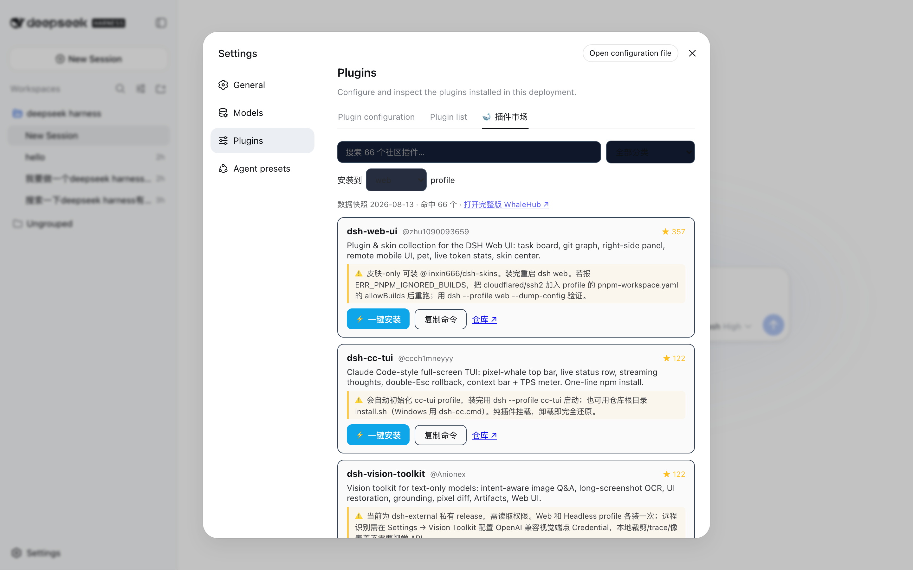

# 🐋 whalehub-market

把 [WhaleHub](https://github.com/vvlife/whalehub-dsh) 插件市场搬进 **DSH Web**：
安装本插件后，打开 `dsh web` → **Settings → Plugins → 🐋 插件市场**，
即可在 DSH 里直接浏览、搜索、**一键安装** 66+ 社区插件，无需打开浏览器复制命令。



## 安装

```sh
# 仓库渠道（推荐，无需 npm 账号）
dsh plugin --profile web add "github:vvlife/whalehub-dsh#main&path:/plugin"

# 装完重启
dsh web   # http://127.0.0.1:3080 → Settings → Plugins → 🐋 插件市场
```

## 功能

- **实时数据**：host 半并行拉取主站 / GitHub Pages 镜像 / raw.githubusercontent 的 `registry.json`，5 分钟缓存；网络全挂时回退到打包快照（离线可用），卡片页会标注「实时数据 / 离线快照」
- **浏览 / 搜索 / 分类筛选**：与 [whalehub-dsh.vercel.app](https://whalehub-dsh.vercel.app) 同源
- **⚡ 一键安装**：点击按钮即在当前机器执行 `dsh plugin --profile <p> add <target>`（host 半 spawn 参数数组，不经 shell；profile 与 target 白名单校验；自动识别桌面 APP 内置 dsh 运行时，不依赖 PATH），装完提示重启生效
- **📮 提交插件**：工具栏按钮弹出上传规则弹窗，规则同样实时拉自 WhaleHub 的 `/submit-rules.json`（多源回退 + 内置快照兜底），规则更新无需升级插件
- **📋 手动通道**：每个插件仍可一键复制安装命令；`manual` 类型插件（如 oh-my-dsh 能力库）给出完整安装步骤
- **⚠️ 安装须知**：来自实测笔记的坑点直接写在卡片上（pnpm approve-builds、私有仓库权限等）
- **安全**：所有 `/whalehub/api` 路由过 Host 头 loopback 信任围栏（与 /api 网关同级的 DNS-rebinding 防御）

## 架构

```
plugin/
├── src/index.ts        host 半：/whalehub/api（registry / install / installed）
├── src/client/         client 半：注册进 Settings → Plugins 的 root list slot
│   └── MarketTab.tsx   市场 UI（搜索/筛选/安装/复制）
├── registry/           WhaleHub 注册表快照（sync 脚本自动更新）
├── cordis.patch.yml    bundle patch：dsh plugin add 一条命令安装并挂载
└── dsh.plugin.json     .dsh-plugin 注册表渠道 manifest
```

参考实现：官方 `ui-settings-plugin-inventory`（slot 注册）与
`dsh-better-sidebar`（双半包构建 / webServer 路由 / 信任围栏）。

## 开发

```sh
cd plugin
npm install
npm run build     # tsdown → lib/（host ESM + client CJS 模块工厂 ×2 渠道 id）
npm test          # vitest：安装目标校验 / 信任围栏 / 参数构造
```

## License

MIT
